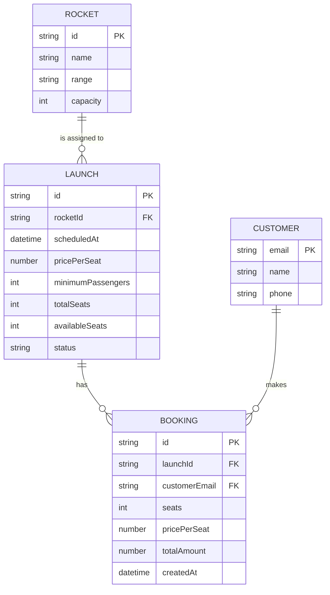

# AstroBookings Entity-Relationship Model

## Entities

### Rocket
- **id**: UUID (primary key, generated)
- **name**: string (unique)
- **range**: `suborbital` | `orbital` | `moon` | `mars`
- **capacity**: integer (1–10)

### Launch
- **id**: UUID (primary key, generated)
- **rocketId**: UUID (foreign key → Rocket)
- **scheduledAt**: ISO-8601 DateTime (future)
- **pricePerSeat**: positive number
- **minimumPassengers**: integer (1–totalSeats)
- **totalSeats**: integer (snapshot of Rocket.capacity at creation, immutable)
- **availableSeats**: integer (initialized to totalSeats; decremented on booking)
- **status**: `scheduled` | `confirmed` | `suspended` | `successful` | `cancelled`

- `totalSeats` is immutable after creation.
- `availableSeats` cannot be negative.
- Status transitions follow a controlled lifecycle; terminal states are `successful` and `cancelled`.

### Customer
- **email**: string (primary key, unique; normalized to lowercase and trimmed)
- **name**: string (non-empty)
- **phone**: string (non-empty)

- Email is the unique customer identifier.
- Email matching is case-insensitive (stored and compared normalized).

### Booking
- **id**: UUID (primary key, generated)
- **launchId**: UUID (foreign key → Launch)
- **customerEmail**: string (foreign key → Customer.email)
- **seats**: integer (positive, <= launch.availableSeats at booking time)
- **pricePerSeat**: number (snapshot of Launch.pricePerSeat at booking time)
- **totalAmount**: number (computed: seats × pricePerSeat)
- **createdAt**: ISO-8601 DateTime (set at creation)

- `seats` must be a positive integer and cannot exceed the launch `availableSeats` at the time of booking.
- `pricePerSeat` and `totalAmount` are snapshots; they do not change if the launch price is later updated.
- A booking is only persisted after seat availability is confirmed.

## Relationships

> Payment entity will be added when FR6 is specified.
