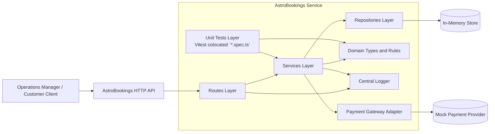

# AstroBookings Architectural Design Document

AstroBookings is a modular Express + TypeScript backend API for managing rockets, launches, customers, and bookings with clear domain boundaries and in-memory persistence.

### Table of Contents
- [Stack and tooling](#stack-and-tooling)
  - [Technology Stack](#technology-stack)
  - [Development Tools](#development-tools)
- [Systems Architecture](#systems-architecture)
- [Software Architecture](#software-architecture)
- [Architecture Guardrails](#architecture-guardrails)
- [Testing Strategy and Quality Gates](#testing-strategy-and-quality-gates)
- [Skill-Aligned Delivery Workflow](#skill-aligned-delivery-workflow)
- [Architecture Decisions Record (ADR)](#architecture-decisions-record-adr)
  - [ADR 1: Layered modular monolith](#adr-1-layered-modular-monolith)
  - [ADR 2: In-memory repositories as persistence boundary](#adr-2-in-memory-repositories-as-persistence-boundary)
  - [ADR 3: Launch capacity snapshot and lifecycle invariants](#adr-3-launch-capacity-snapshot-and-lifecycle-invariants)
  - [ADR 4: Payment-first booking flow with gateway adapter](#adr-4-payment-first-booking-flow-with-gateway-adapter)
  - [ADR 5: Vitest for colocated unit testing](#adr-5-vitest-for-colocated-unit-testing)
  - [ADR 6: Skill-driven delivery governance](#adr-6-skill-driven-delivery-governance)

## Stack and tooling

### Technology Stack
- Language: TypeScript 5.8 (strict typing)
- Runtime: Node.js
- Framework: Express 5.2
- Testing: Vitest 4 (colocated unit), Playwright 1.59 (smoke/E2E)
- Storage: In-memory repositories (no external database yet)
- Logging: Centralized logger with level filtering through `LOG_LEVEL`

### Development Tools
- Package manager and scripts: npm
- Test runner and coverage: Vitest 4 + `@vitest/coverage-v8`
- Typical workflow:
  - Install dependencies: `npm install`
  - Build: `npm run build`
  - Run in development: `npm run dev`
  - Run unit tests in development mode: `npm run test:dev`
  - Run unit tests once: `npm run test:unit`
  - Run unit coverage: `npm run test:coverage`
  - Run unit tests via default script: `npm test`
  - Run smoke tests: `npm run test:smoke`
- CI/CD: Not mandatory in current scope; recommended pipeline is build + unit tests + smoke tests.

## Systems Architecture

AstroBookings uses a single deployable service (modular monolith) exposing a REST API over HTTP. Data is handled in domain modules and persisted in process memory. External integration is planned only for a mock payment gateway adapter.

## Software Architecture

Architecture style: Layered modular monolith with domain-oriented modules.

Current and planned modules:
- `health`: technical health endpoint.
- `rockets`: rocket catalog and capacity constraints.
- `launches`: schedule, update, and status transitions.
- `customers`: customer registration and uniqueness by email.
- `bookings`: seat reservation per launch and customer.
- `payments` (planned): payment authorization/capture through a mock provider.

Layer responsibilities:
- Routes:
  - Parse/validate HTTP input.
  - Map domain/service errors to HTTP responses.
  - Keep business logic out of controllers.
- Services:
  - Enforce business rules and lifecycle invariants.
  - Coordinate repositories and external adapters.
- Repositories:
  - Encapsulate CRUD and query operations for in-memory data.
  - Hide storage details from service consumers.
- Types:
  - Define domain entities, DTOs, and constrained value sets.

Core data flow:
1. Client sends HTTP request to route.
2. Route validates payload and calls service.
3. Service applies invariants and calls repository/adapters.
4. Service returns entity or typed error.
5. Route maps to status code + JSON response.

Planned booking flow:
1. Validate customer exists and launch is bookable.
2. Validate requested seats <= available seats.
3. Request payment authorization/capture through payment adapter.
4. Persist booking only on successful payment.
5. Decrement launch available seats atomically in service transaction boundary (single-threaded process assumption for in-memory stage).

## Architecture Guardrails

- Enforce one-way dependencies: `routes` -> `services` -> `repositories`/`adapters`.
- Keep HTTP concerns in routes only (validation, transport mapping, status codes).
- Keep business rules, invariants, and orchestration in services.
- Keep repositories limited to storage concerns; no business logic in repositories.
- Access external providers only through adapters.
- Keep domain/service errors typed and map them at route level.
- Preserve seat invariants:
  - `totalSeats` immutable after launch creation.
  - `availableSeats` never negative.
- Enforce booking flow order:
  1. Validate customer and launch constraints.
  2. Validate seat availability.
  3. Process payment through adapter.
  4. Persist booking only if payment succeeds.
  5. Decrement `availableSeats` after booking persistence.

## Testing Strategy and Quality Gates

Testing levels:
- Unit tests (Vitest): service and utility business rules in isolation.
- E2E/smoke tests (Playwright): API contracts and cross-module flows.

Quality gates:
- Feature or refactor:
  1. `npm run build`
  2. `npm run test:unit`
  3. `npm run test:smoke` (for impacted flows)
- Bug fix:
  1. Add failing regression test.
  2. Run build and affected test scope.

## Skill-Aligned Delivery Workflow

Delivery stages:
1. Product alignment: generate or update PRD.
2. Scope definition: create feature/bug/chore spec.
3. Implementation design: create implementation plan aligned with ADD.
4. Implementation: apply layered architecture with strict boundaries.
5. Verification: unit tests first, then E2E/smoke based on impact.
6. Release hygiene: update AGENTS, changelog, and version artifacts.

Skills mapping:
- Product/architecture: `generating-prd`, `generating-add`.
- Scope/planning: `generating-specs`, `planning-specs`.
- Implementation: `coding-express-api`, `coding-type-script`.
- Verification: `testing-unit-vitest`, `unit-testing`, `testing-e2e-playwright`.
- Delivery/maintenance: `commit-changes`, `releasing-version`, `merging-default`.

## Architecture Decisions Record (ADR)

### ADR 1: Layered modular monolith
- **Decision**: Use a single Node.js service with route/service/repository layers and domain-based modules.
- **Status**: Accepted
- **Context**: Product scope is small-medium, with low operational complexity and fast iteration goals.
- **Consequences**: Fast delivery and low infra overhead now; future extraction to microservices remains possible if domain boundaries stay clean.

### ADR 2: In-memory repositories as persistence boundary
- **Decision**: Persist entities in-memory behind repository interfaces.
- **Status**: Accepted
- **Context**: Initial stage explicitly excludes database infrastructure.
- **Consequences**: Simpler setup and deterministic tests; data is ephemeral and not horizontally scalable until a real datastore is introduced.

### ADR 3: Launch capacity snapshot and lifecycle invariants
- **Decision**: Snapshot rocket capacity into launch `totalSeats` at launch creation and enforce explicit launch status transitions.
- **Status**: Accepted
- **Context**: Launch availability must remain stable even if rocket data changes later; invalid status transitions must be blocked.
- **Consequences**: Predictable booking math and stronger consistency; requires strict validation logic in launch services.

### ADR 4: Payment-first booking flow with gateway adapter
- **Decision**: Implement bookings with a payment adapter and persist bookings only after successful payment.
- **Status**: Accepted
- **Context**: PRD requires billing at booking time and no seat decrement on payment failure.
- **Consequences**: Prevents unpaid reservations and keeps side effects controlled; requires idempotent handling strategy when moving beyond mock provider.

### ADR 5: Vitest for colocated unit testing
- **Decision**: Use Vitest for service and utility unit tests with colocated `*.spec.ts` files.
- **Status**: Accepted
- **Context**: TypeScript + ES module runtime needs zero-config ESM support, while Playwright already covers E2E behavior in `tests/`.
- **Consequences**: Faster TDD feedback loops, improved test discoverability near source files, and simple mocking for isolated business-rule verification.

### ADR 6: Skill-driven delivery governance
- **Decision**: Adopt a skill-aligned, artifact-driven workflow as the default delivery model.
- **Status**: Accepted
- **Context**: The project uses an explicit skills catalog and role-based agents to standardize delivery from requirements to release.
- **Consequences**: Higher consistency and traceability across changes, with a documentation maintenance cost when skills evolve.
